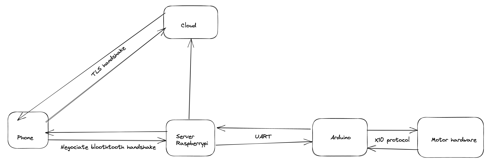

# Smart lock - Home automation project

2nd semester project at Aarhus University School of Engineering.

This git repository contains all the source code for the software related to this project, including cloud server, bridge server, native phone app etc.

The server Raspberry Pi is also referred to as the "Bridge" and Phone as "Mobile".
